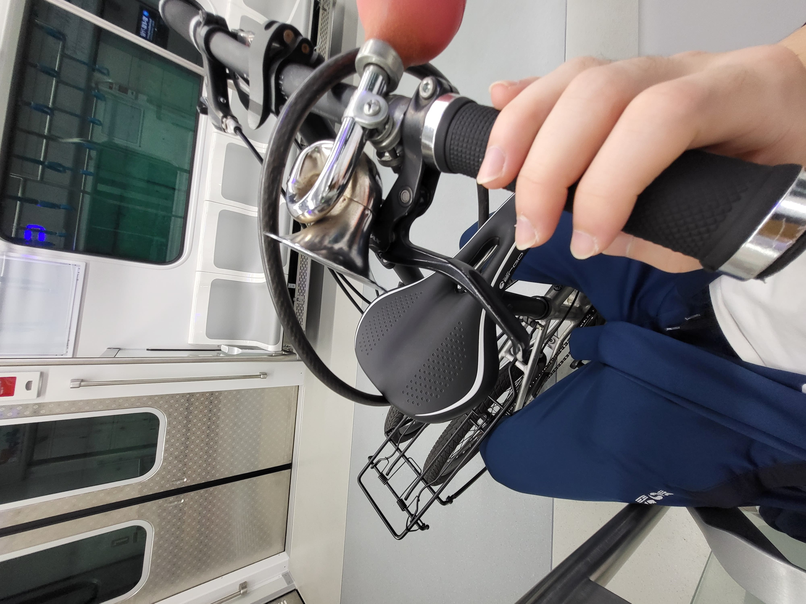
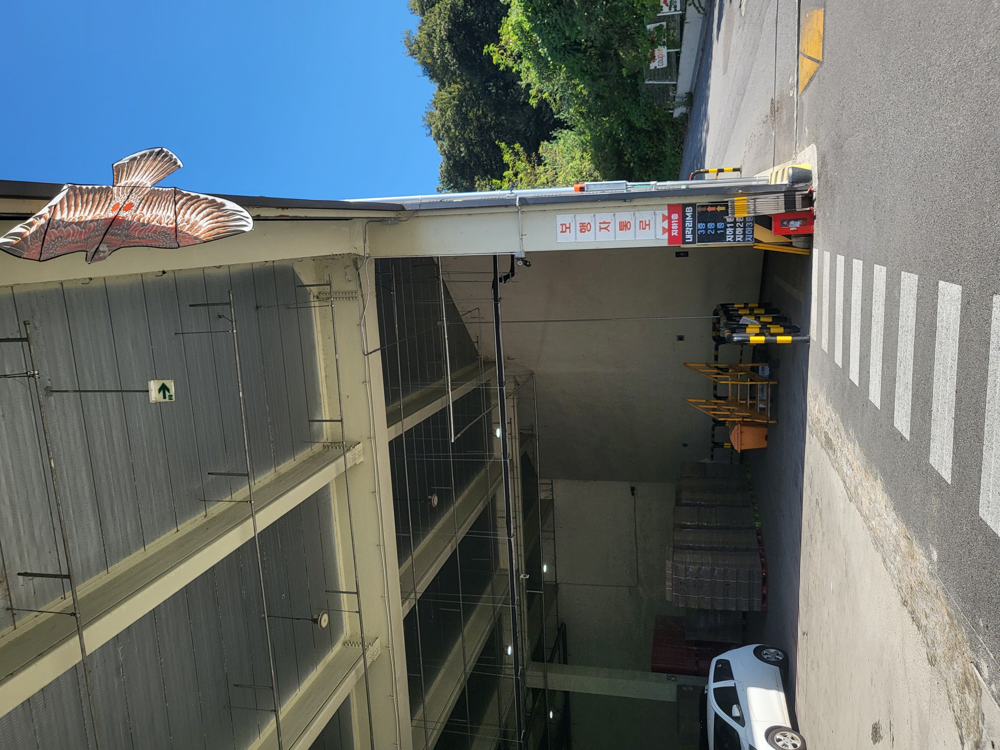
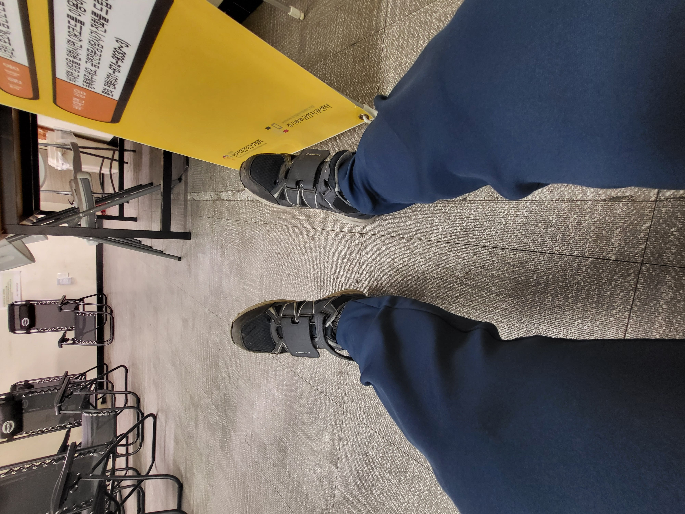
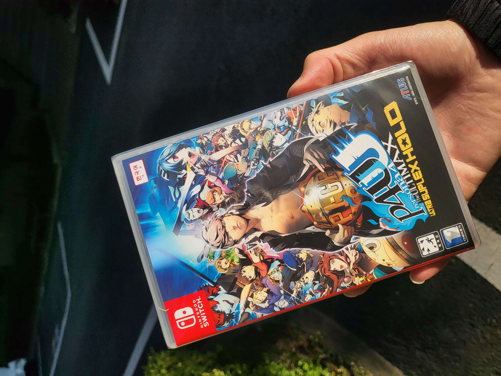
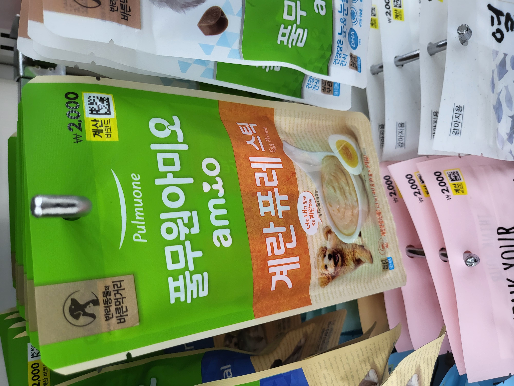
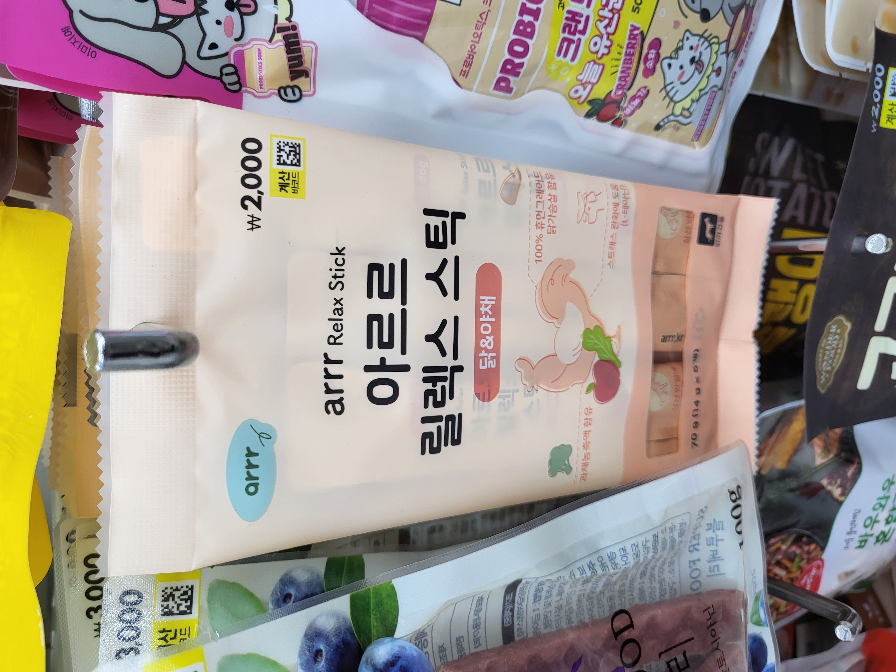
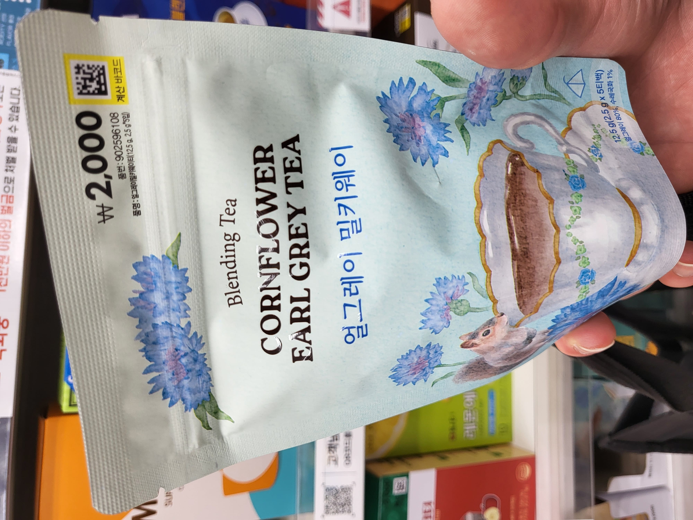
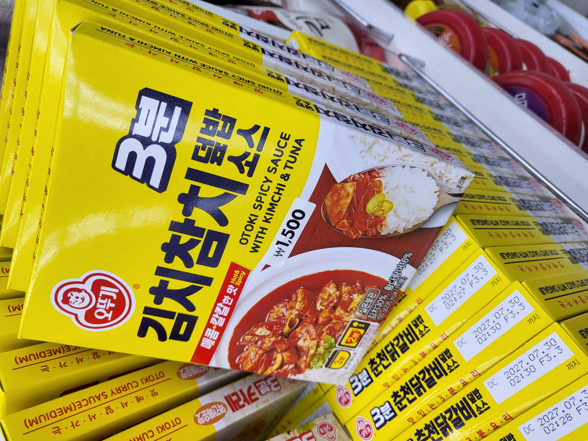

전역하고 지금까지 두 달 반 정도 쿠팡 CLS 주간조 아르바이트를 뛰고 있다.

오전 10시 - 오후 15시 이렇게 짧게 뛰고 끝나는 식인데, 은근 괜찮다.

캠프 주간조는 셔틀이 없어 이렇게 직접 캠프로 출근해 일을 한다.

나 같은 경우 전철 - 자전거로 쉽게 왔다갔다 할 수 있어서 별 걱정이 없다.

캠프 내부 사무실에 들어가서 신발을 작업화로 갈아 신고 근무 시작 대기...

일이 끝나고는 집에 빨리 오면 15시 40분에서 16시이다.

오늘 저번에 주문해 둔 **페르소나 4 디 얼티맥스 울트라 수플렉스 홀드**... 이름 엄청 긴 **페르소나 4 더 골든**의 정식 후속작을 배송받았다.

사실 집에 들러 씻고 다이소 가는 길에 배송 받아서 그냥 가는 길에 바로 까 봄 ㅋ

강아지 간식들 좀 사 주고...

집에 씹는 것들 엄청 많아서 이번엔 좀 핥아먹는 그런 걸로 사 봤다.

이건 옛~날에 그린필드 밀키 우롱이라는 정말 맛있게 먹었던 차가 하나 있는데 그거랑 비슷한 컨셉인 것 같길래 하나 사 봤다.

근데... 오리지널 밀키 우롱은 정말 그 은은하고 달달한 부드러운 향이 혀에 착 감기는 반면 얘는 그냥 그 합성 향을 어거지로 얼그레이랑 섞어 놓은 듯한 느낌이다...

마지막으로 다이소에서 꼭 사야 할 템 중 하나인 이 고추 참치 키트.

이거 진짜 매콤하고 건더기도 다른 키트에 비해 실하고 진짜 새콤매콤 정말 맛있다.