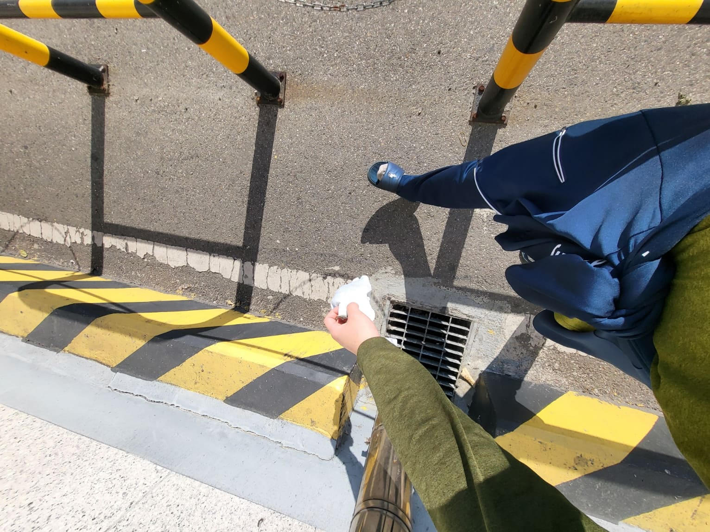
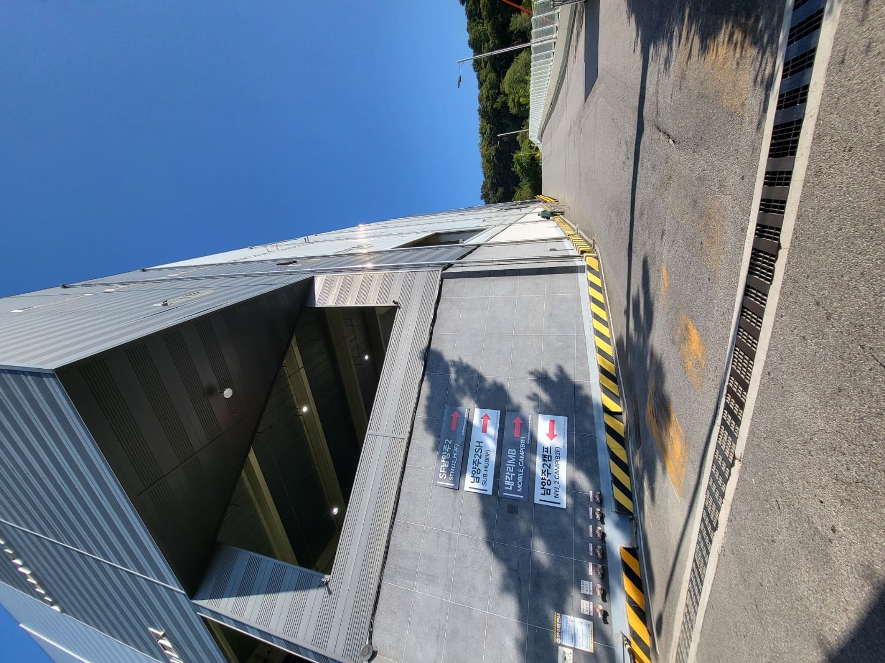
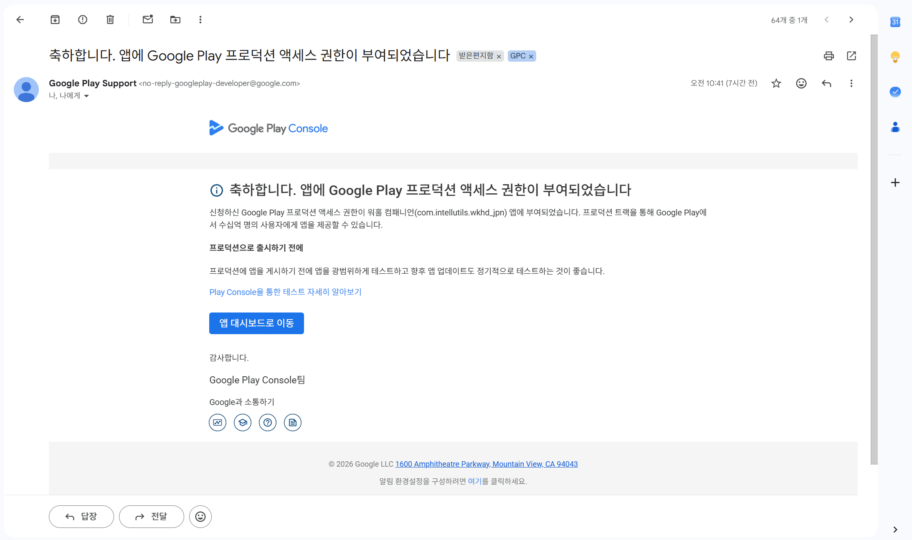
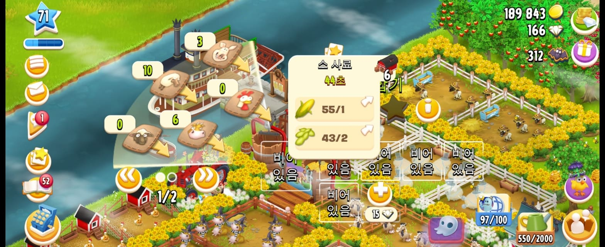
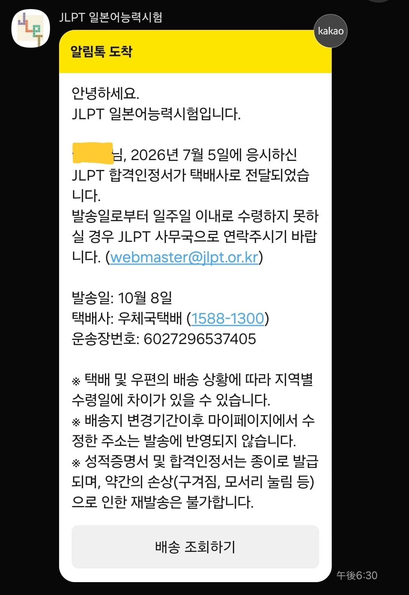
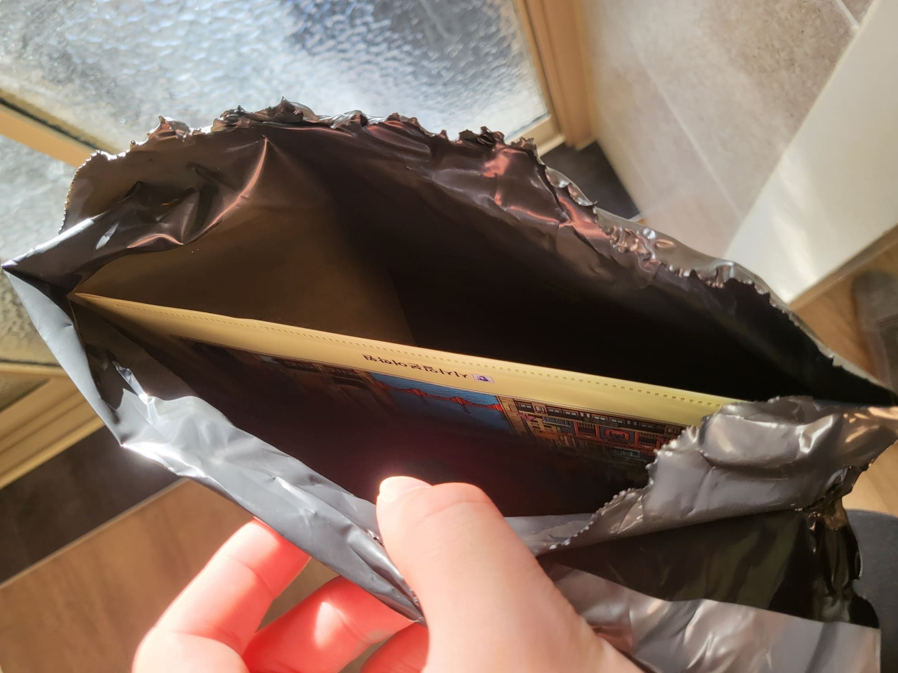
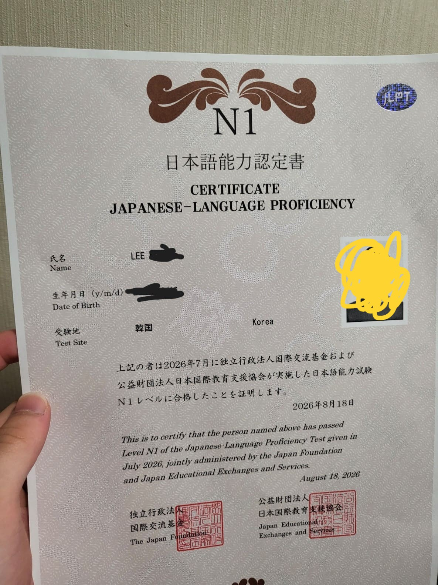

오늘 한글날도 쿠팡에 일 하러 갔다.

쿠팡 캠프는 진짜 오히려 오늘같은 빨간 날이나 주말 및 연휴 시즌에 오히려 한가해서 좋다.

돈도 더 주고 일은 별로 없고...

그리고 드디어 기다리고 기다리던, **워홀 컴패니언** 프로덕션 준비가 완료되었다.

내가 실제 일본 워킹 홀리데이에 가 사용할 앱이기에, 앞으로 철저히 유지 및 보수해 나가려고 한다.

지금 실제 사용자 두 분이 계시는데, 이런 저런 피드백 몇 건을 받아 앱을 수정했다.

아주 좋은 경험이었다.

그리고 최근 ***Supercell*** 의 **HayDay** 라는 게임에 복귀했다.

원래 중학교 1학년 때부터 시작해 군대 가기 전 2024년 말까지 플레이했기 때문에 이젠 그냥 인생 게임이 되었다.

이 사진은 그냥 사료 만드는 속도가 너무 빨라 어이없어 찍은 사진 ㅋ

부스터를 써 버리니 소 사료가 44초, 닭 사료가 제작에 10초 걸린다.

그리고 오늘 JLPT 합격 증명서? 가 종이로 집에 도착했다.

이렇게 아주 간단히 포장되어 오고 용케도 안 구겨져서 왔다.

역시 쿠팡이랑 다르게 우체국 택배 대단합니다...

이게 합격 종이다.

실제 얼굴과 다른 **사기 증명 사진**을 첨부하여 제작된 것이므로 그냥 모자이크 없이 올린다.

원래 안경 쓰고 머리도 저렇게 안 넘기는데 그래서 저 사진 볼 때마다 너무 오글거린?다.

어쨌든 이제 일본 곧 넘어가니 더욱 더 철저히 준비해야겠다.