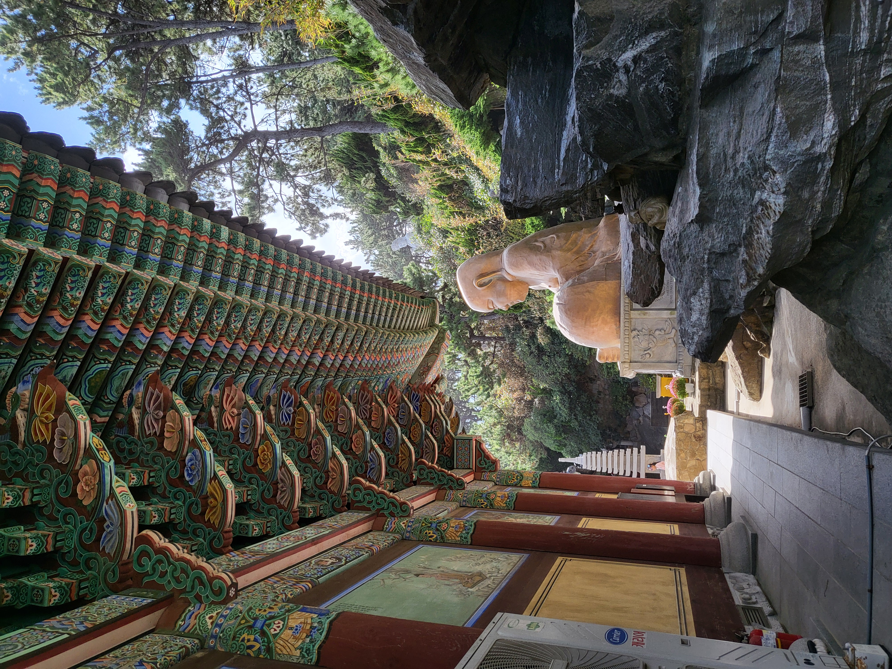

요번에 잠깐 시골 놀러갔다가 부산에 당일치기로 갔다왔는데, 외국인들이 너무 많아서 놀랐다.

중국말이 들리긴 하나 간체자가 아닌 번체자를 다들 쓰길래 대충 중국은 아닌 것 같고 대만인 것 같다.

그리고 서양인들도 참 많았고 스페인같은 유럽 계열 사람들 같았다.

저녁엔 광안리 해수욕장에 갔는데 다음 날이 휴일인지라 사람들이 엄청 많았고 가족 여행이라 좀 아쉬웠다.

친구들이랑 오면 아주 재밌게 놀 자신 있는데 가족 여행이 확실히 재미는 없는 것 같다.
